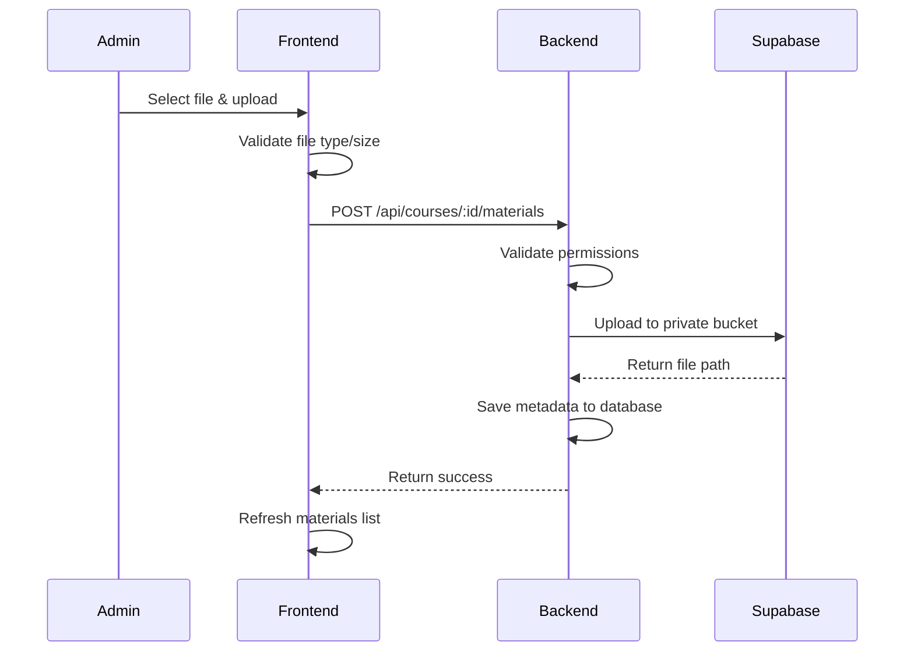
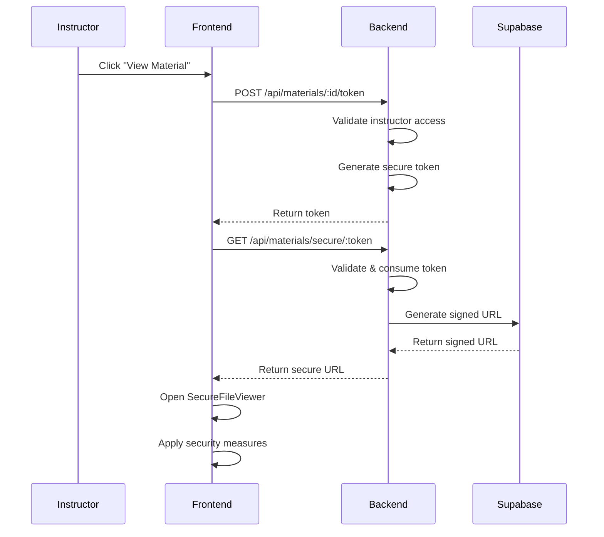

# Secure Course Materials System

This document describes the comprehensive secure file upload and viewing system for course materials in the PlayFit LMS.

## 🔒 Security Overview

The system implements multiple layers of security to prevent unauthorized access, downloads, and screenshots of course materials:

### 1. **Access Control**
- **Role-based permissions**: Only admins can upload materials, only assigned instructors can view them
- **Course-specific access**: Instructors can only access materials for courses they're assigned to
- **Temporary access tokens**: All file access requires time-limited tokens (30 minutes)
- **Session validation**: Every request validates user authentication and authorization

### 2. **File Storage Security**
- **Private Supabase bucket**: Files stored in private bucket, not publicly accessible
- **Signed URLs**: Temporary signed URLs with short expiration (5 minutes for viewing)
- **Encrypted file paths**: Random UUIDs prevent path guessing
- **MIME type validation**: Only allowed file types can be uploaded

### 3. **Screenshot Prevention**
- **Keyboard shortcut blocking**: Prevents common screenshot shortcuts (Cmd+Shift+3/4/5, PrintScreen, etc.)
- **Context menu disabled**: Right-click disabled to prevent "Save image as"
- **Developer tools detection**: Detects and blocks dev tools opening
- **Visibility monitoring**: Blurs content when window loses focus or tab switching
- **Mobile protection**: Detects mobile screenshot gestures and screen recording
- **Print prevention**: Blocks Cmd+P/Ctrl+P print shortcuts

### 4. **Download Protection**
- **No direct downloads**: Files served through secure viewer only
- **Content-Disposition inline**: Forces inline viewing, prevents download prompts
- **Cache prevention**: Headers prevent browser caching
- **Copy/paste disabled**: Text selection and copying disabled
- **Drag & drop blocked**: Prevents dragging images/content

### 5. **Monitoring & Logging**
- **Access logging**: Every file access attempt logged with user, IP, timestamp
- **Security violation tracking**: Screenshot/download attempts logged
- **Real-time alerts**: Security violations reported immediately
- **Audit trail**: Complete history of who accessed what and when

## 📁 System Architecture

### Database Schema

#### `course_materials`
```sql
- id: Primary key
- course_id: Reference to courses table
- title: Material title
- description: Optional description
- file_type: pdf, ppt, image, document
- file_name: Original filename
- file_path: Supabase storage path (UUID-based)
- file_size: File size in bytes
- mime_type: MIME type for validation
- is_secure: Security flag (default: true)
- access_level: instructor, admin
- upload_by: User who uploaded the file
- created_at, updated_at: Timestamps
```

#### `course_material_access_logs`
```sql
- id: Primary key
- material_id: Reference to course_materials
- user_id: User who accessed the material
- access_type: view, upload, delete, screenshot_attempt, download_attempt
- ip_address: User's IP address
- user_agent: Browser/device information
- access_granted: Whether access was allowed
- blocked_reason: Reason if access was blocked
- accessed_at: Timestamp
```

#### `secure_file_tokens`
```sql
- id: Primary key
- material_id: Reference to course_materials
- user_id: User the token was generated for
- token: Unique access token (32-byte hex)
- expires_at: Token expiration time (30 minutes)
- is_used: Whether token has been consumed
- created_at: Token generation time
```

### API Endpoints

#### Admin Endpoints
```
POST /api/courses/:courseId/materials - Upload course material
DELETE /api/materials/:materialId - Delete course material
GET /api/materials/:materialId/logs - Get access logs (admin only)
```

#### Instructor/Admin Endpoints
```
GET /api/courses/:courseId/materials - List course materials
POST /api/materials/:materialId/token - Generate viewing token
GET /api/materials/secure/:token - Get secure file URL
POST /api/materials/report/screenshot - Report screenshot attempt
POST /api/materials/report/download - Report download attempt
```

## 🚀 Implementation Guide

### 1. Backend Setup

1. **Run Database Migration**
   ```bash
   cd backend
   npm run migrate:full
   ```

2. **Set up Supabase Storage**
   ```bash
   node src/scripts/setupStorage.js
   ```

3. **Configure Environment Variables**
   ```env
   SUPABASE_URL=your_supabase_url
   SUPABASE_SERVICE_ROLE_KEY=your_service_role_key
   SUPABASE_BUCKET=playfit-storage
   ```

### 2. Frontend Integration

1. **Add to Course Management**
   - Navigate to `/admin/courses/:id/materials`
   - Upload materials (admin only)
   - View materials securely (instructors)

2. **Security Components**
   - `SecureFileViewer`: Main secure viewing component
   - `CourseMaterialsManager`: Upload and management interface
   - `screenshotPrevention.ts`: Advanced security utilities

### 3. File Upload Flow



### 4. Secure Viewing Flow



## 🛡️ Security Features Detail

### Screenshot Prevention Techniques

1. **Keyboard Monitoring**
   - Blocks Cmd+Shift+3/4/5 (Mac screenshots)
   - Blocks PrintScreen, Alt+PrintScreen (Windows)
   - Blocks F12, Cmd+Shift+I (Developer tools)
   - Blocks Cmd+S, Cmd+P (Save, Print)

2. **Visual Protection**
   - Content blurs when window loses focus
   - Overlay warnings about security violations
   - Invisible watermarks for forensic tracking
   - Disabled text selection and right-click

3. **Developer Tools Detection**
   - Window size monitoring (dev tools change viewport)
   - Console usage detection
   - Debugger statement timing analysis
   - Automatic content hiding when detected

4. **Mobile Protection**
   - iOS: Multi-touch gesture detection
   - Android: Volume+Power button combination
   - Screen recording API monitoring
   - Device orientation change detection

### File Access Security

1. **Token-based Access**
   - Cryptographically secure tokens (256-bit)
   - Short expiration times (30 minutes for tokens, 5 minutes for URLs)
   - Single-use tokens prevent replay attacks
   - Automatic cleanup of expired tokens

2. **Network Security**
   - HTTPS-only communication
   - Signed URLs from Supabase
   - No-cache headers prevent local storage
   - Content-Security-Policy headers

3. **Access Validation**
   - Multi-layer permission checks
   - Course-instructor relationship validation
   - Real-time session verification
   - IP address logging for forensics

## 📊 Monitoring & Analytics

### Access Logs
- Every file access is logged with full context
- Failed access attempts tracked
- Security violations recorded with details
- Performance metrics for optimization

### Security Alerts
- Real-time notifications for violations
- Automated blocking of suspicious activity
- Detailed forensic information collection
- Integration with admin dashboard

### Compliance Features
- Audit trail for regulatory compliance
- Data retention policies
- User consent tracking
- Privacy protection measures

## 🔧 Configuration Options

### Security Levels
```javascript
// Strict mode (maximum security)
const config = {
  strictMode: true,
  blurOnViolation: true,
  tokenExpiry: 1800, // 30 minutes
  urlExpiry: 300,    // 5 minutes
  maxAttempts: 3
};

// Standard mode (balanced security/usability)
const config = {
  strictMode: false,
  blurOnViolation: true,
  tokenExpiry: 3600, // 1 hour
  urlExpiry: 600,    // 10 minutes
  maxAttempts: 5
};
```

### File Type Restrictions
```javascript
const allowedTypes = [
  'application/pdf',
  'application/vnd.ms-powerpoint',
  'application/vnd.openxmlformats-officedocument.presentationml.presentation',
  'image/jpeg',
  'image/png',
  'image/webp',
  'image/gif',
  'application/msword',
  'application/vnd.openxmlformats-officedocument.wordprocessingml.document',
  'text/plain'
];
```

## 🚨 Security Considerations

### Known Limitations
1. **Browser Extensions**: Some extensions might bypass JavaScript restrictions
2. **Screen Recording Software**: External recording software cannot be completely blocked
3. **Physical Photography**: Cannot prevent photographing the screen with external devices
4. **Browser Developer Mode**: Advanced users might find ways to bypass some restrictions

### Mitigation Strategies
1. **Legal Agreements**: Terms of service and usage agreements
2. **Watermarking**: Invisible forensic watermarks for tracking
3. **User Education**: Training on proper usage and security importance
4. **Regular Updates**: Continuous improvement of security measures

### Best Practices
1. **Regular Security Audits**: Periodic review of access logs and security measures
2. **User Training**: Educate instructors on security importance
3. **Incident Response**: Clear procedures for security violations
4. **Backup Security**: Multiple layers of protection

## 📈 Performance Optimization

### Caching Strategy
- No client-side caching for security
- Server-side optimization for token generation
- Efficient database indexing for access logs
- CDN usage for non-sensitive assets only

### Scalability Considerations
- Horizontal scaling of token generation
- Database partitioning for large access logs
- Supabase storage auto-scaling
- Load balancing for high traffic

## 🔄 Maintenance

### Regular Tasks
1. **Token Cleanup**: Automated removal of expired tokens
2. **Log Rotation**: Archive old access logs
3. **Security Updates**: Keep prevention techniques current
4. **Performance Monitoring**: Track system performance

### Monitoring Alerts
- High number of security violations
- Unusual access patterns
- System performance degradation
- Storage quota approaching limits

This secure course materials system provides enterprise-grade protection for sensitive educational content while maintaining a smooth user experience for legitimate access.